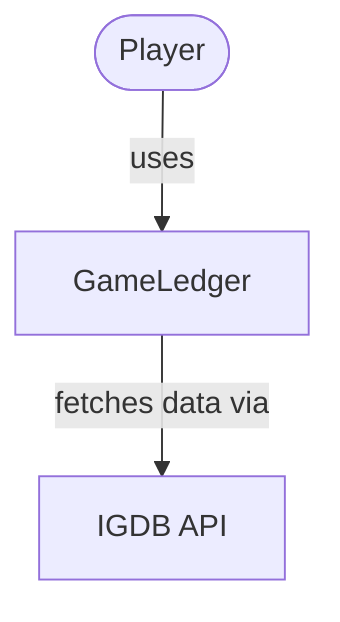
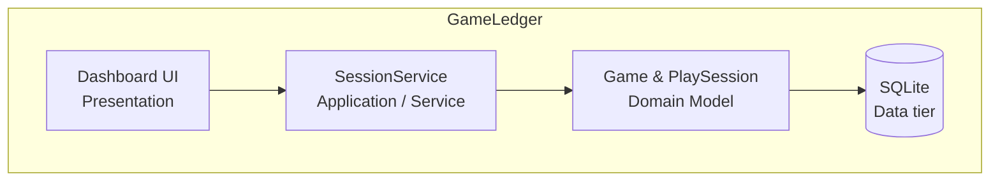
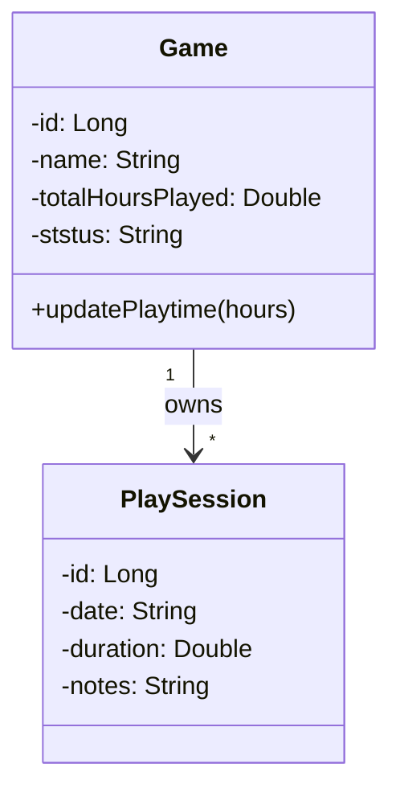
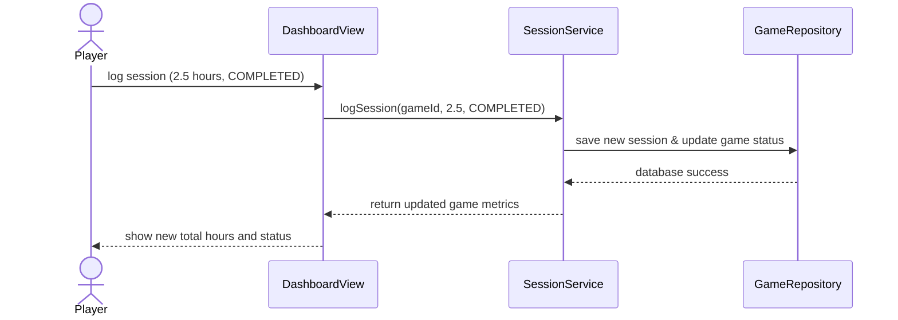

# GameLedger

<!-- CI badge: after Session 4, replace ORG/REPO and the workflow filename, then uncomment:

-->

**Student:** [David Liendo] · **Course:** CEN 5064 Software Design, Fall 2026 · **Partner:** [@kummarimonisha]

## Project

**GameLedger** is a personal video game backlog and play-session management system that is designed for gamers/players who want a local tool to efficiently
organize their game libraries, track active playthroughs, and understand their time-investment habits. The system is built around four core features:
(1) a library catalog to add and organize games using customizable status tags like Backlog, In Progress, Completed, and Abandoned; (2) a session
logging tool to record play dates, duration in hours, and personal progress notes; (3) a metrics dashboard that generates completion statistics
and tracks total time spent per genre or platform; and (4) an external API integration that dynamically fetches basic game metadata and cover art
to populate the user's library.

## How to run

```
[Exact commands to build and run your system from a clean clone.
Update this every time the steps change — your partner and your
instructor will follow it literally on conference days.]
```

## Architecture

### Tier breakdown (Session 2 studio)

| Tier | Responsibilities in THIS system |
|------|--------------------------------|
| Presentation | Displays the player's game library, shows their calculated playtime metrics, and provides the forms/buttons to add new games, log a play session, or complete/abandon the current game they are logging their session in.<br><br> - **DashboardView:** Renders the main screen showing the list of games, their current statuses, and overall time-played metrics.<br><br> - **LogSessionForm:** UI component that collects the date, time spent playing, notes, and optional state-change toggle when you log a session.<br><br> - **GameSearchController:** Captures the text you type in when searching for a new game to add to your backlog. |
| Service | Receives the input from the Presentation tier (UI), enforces business rules, interacts with external integrations (IGDB), and tells the Data tier what to save.<br><br> - **SessionService:** Contains the **logSession(gameId, hours, notes, newStatus)** method. It handles validating the hours, saving the session, and seamlessly updating the game's total playtime and status if either **COMPLETED** or **ABANDONED** have been checked during the same workflow.<br><br> - **LibraryService:** Contains the **addGameToBackLog()** method, which calls the external API for cover art and metadata before saving it as a new game.<br><br> - **MetricsService:** Aggregates the data to calculate the player's completion percentage and total hours played across all genres. |
| Domain | Classes that represent the concepts, state, and behavior of the application/system.<br><br> - **Game:** An entity containing properties like **title**, **platform**, **totalHoursPlayed**, and an enum for **GameStatus** (BACKLOG, IN_PROGRESS, COMPLETED, ABANDONED).<br><br> - **PlaySession:** An entity containing **date**, **duration**, and **journalNotes**.<br><br> - _Rule:_ "A **PlaySession** can trigger a **Game** state transition," and "A game's **totalHoursPlayed** must equal the sum of its associated **PlaySession** durations." |
| Data | Abstracts away the complex SQL queries behind simple interfaces so the Service tier doesn't have to deal with them directly.<br><br> - **GameRepository** (Interface): Defines contracts like **save(Game)**, **updateStatus(gameId, newStatus)**, and **findAllByStatus(status)**.<br><br> - **SqliteGameRepository:** The concrete implementation of the interface that executes the actual SQL **INSERT** and **SELECT** statements against the database.<br><br> - **SessionRepository**: Stores the individual play session records, linking them to their respective games via a foreign key/game ID. |

### C4 — Context & Container (Session 3 studio)





### UML — Class & Sequence (Session 3 studio)





## Architecture Decision Records

Decisions live in [`docs/adr/`](docs/adr/). Start with ADR-001 in Session 4.

| # | Decision | Status |
|---|----------|--------|
| [001](docs/adr/adr-001.md) | [What I am building and why] | [proposed] |

## Weekly log (optional but recommended)

A one-line note per week keeps your commit story readable:

- Week 1 (Aug 24): repository created (cen5064-project-liendo), added full name and partner's GitHub username, added Project Title and detailed description of project (what it is, who it's for, and its 3-4 core features)
- Week 2 (Aug 31): added the complete 4-tier breakdown section, updated the section to include COMPLETED and ABANDONED checks while logging in a play session for a game, fixed the structure of the section to look more simpler and easier to read
- Week 3 (Sept 7): updated Weekly log section and logged all past weeks done
- Week 4 (Sept 14): 

## Known Issues
Issue 1: 
