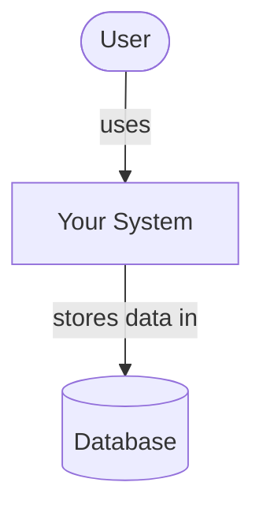
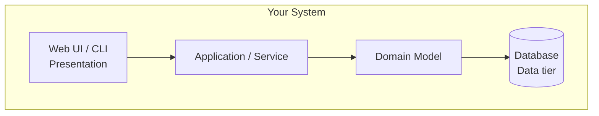
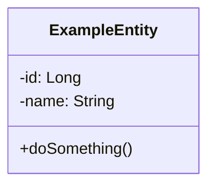
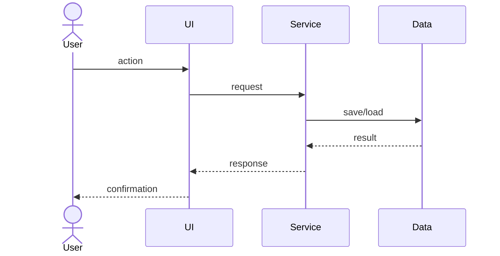

# GameLedger

<!-- CI badge: after Session 4, replace ORG/REPO and the workflow filename, then uncomment:

-->

**Student:** [David Liendo] · **Course:** CEN 5064 Software Design, Fall 2026 · **Partner:** [@kummarimonisha]

## Project

**GameLedger** is a personal video game backlog and play-session management system that is designed for gamers/players who want a local tool to efficiently
organize their game libraries, track active playthroughs, and understand their time-investment habits. The system is built around four core features:
(1) a library catalog to add and organize games using customizable status tags like Backlog, In Progress, Completed, and Abandoned; (2) a session
logging tool to record play dates, duration in hours, and personal progress notes; (3) a metrics dashboard that generates completion statistics
and tracks total time spent per genre or platform; and (4) an external API integration that dynamically fetches basic game metadata and cover art
to populate the user's library.

## How to run

```
[Exact commands to build and run your system from a clean clone.
Update this every time the steps change — your partner and your
instructor will follow it literally on conference days.]
```

## Architecture

### Tier breakdown (Session 2 studio)

| Tier | Responsibilities in THIS system |
|------|--------------------------------|
| Presentation | [what your UI layer does] Displays the player's game library, shows their calculated playtime metrics, and provides the forms/buttons to add new games, log a play session, or complete/abandon the current game they are logging their session in; **DashboardView:** Renders the main screen showing the list of games and the metrics overview. **LogSessionForm:** UI component that collects the date, time spent, and notes when you log a session. **GameSearchController:** Takes the text you type into the search bar and passes it to the Service tier to find a game.|
| Service | [what your use-case/orchestration layer does] Takes the input from the Presentation tier (UI), enforces rules, interacts with external APIs (IGDB), and calls the Data tier to save things; **SessionService:** Contains the **logSession(gameId, hours, notes)** method. It validates that hours are greater than zero, saves the session, and triggers an update to the game's total playtime. **LibraryService:** Contains the **addGameToBackLog()** method, which calls the external API for cover art and metadata before saving it. **MetricsService:** Aggregates data to calculate the player's completion percentage and total hours played across all genres. |
| Domain | [your entities and business rules] Classes represent the concepts of the application/system. **Game:** An entity containing properties like **title**, **platform**, **totalHoursPlayed**, and an enum for **GameStatus** (BACKLOG, IN_PROGRESS, COMPLETED, ABANDONED). **PlaySession:** An entity containing **date**, **duration**, and **journalNotes**. Rule: "A **Game** cannot be marked as COMPLETED if its **totalHoursPlayed** is 0." |
| Data | [how and where data is stored] Hides the complex SQL queries behind simple interfaces so the Service tier doesn't have to write SQL; **GameRepository** (Interface): Defines contracts like **save(Game)**, **findById(id)**, and **findAllByStatus(status)**. **SqliteGameRepository**: The concrete implementation of the interface that actually executes the SQL **INSERT** and **SELECT** statements against the database. **SessionRepository**: Stores the individual play session records linked to a specific game ID. |

### C4 — Context & Container (Session 3 studio)





### UML — Class & Sequence (Session 3 studio)





## Architecture Decision Records

Decisions live in [`docs/adr/`](docs/adr/). Start with ADR-001 in Session 4.

| # | Decision | Status |
|---|----------|--------|
| [001](docs/adr/adr-001.md) | [What I am building and why] | [proposed] |

## Weekly log (optional but recommended)

A one-line note per week keeps your commit story readable:

- Week 1 (Aug 24): repo created, three ideas drafted
- Week 2 (Aug 31): ...
